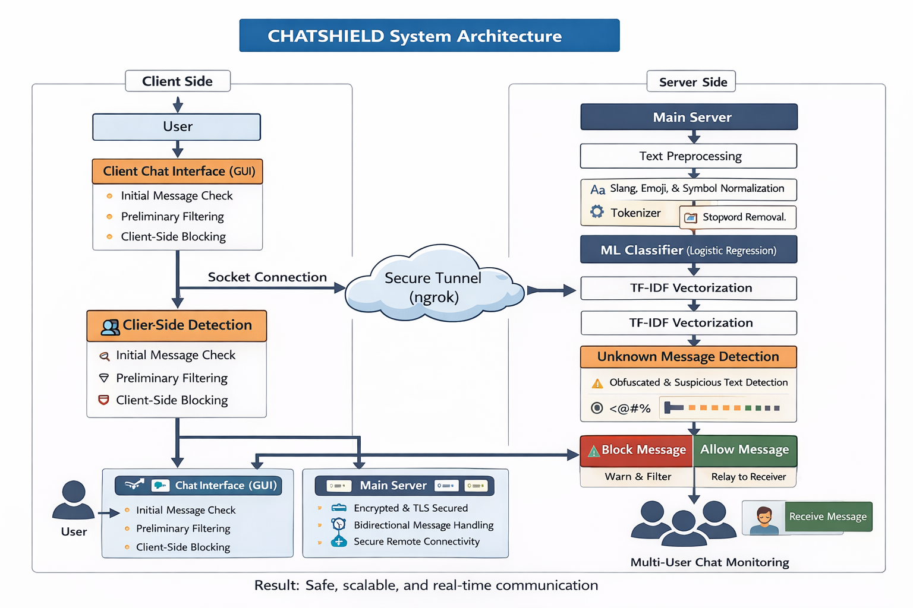
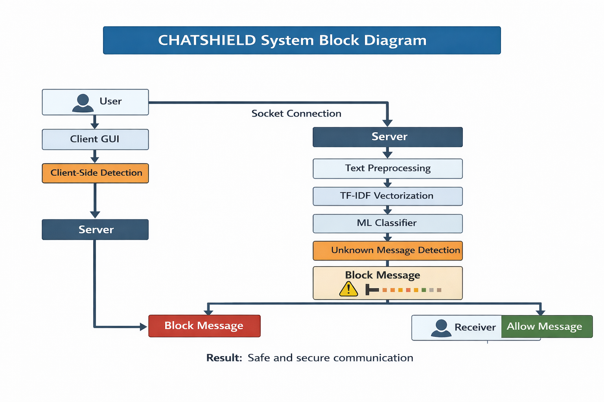
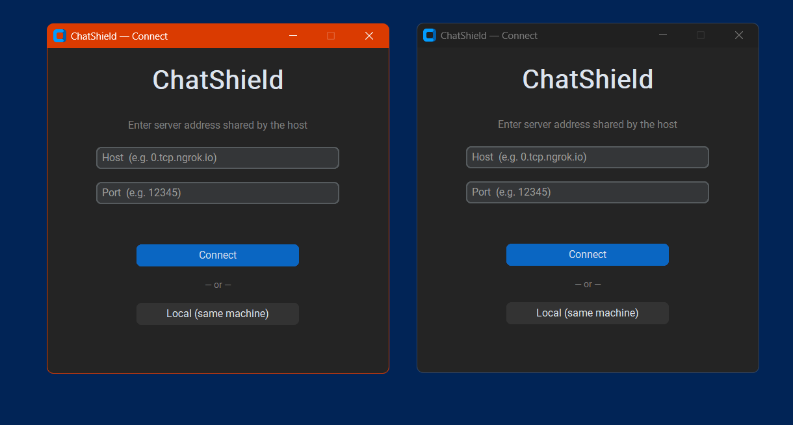
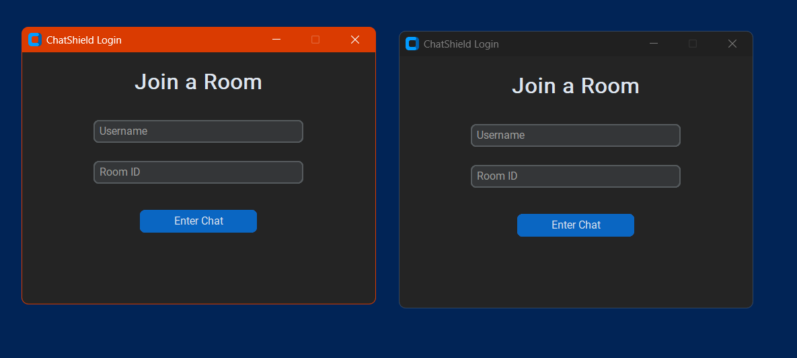
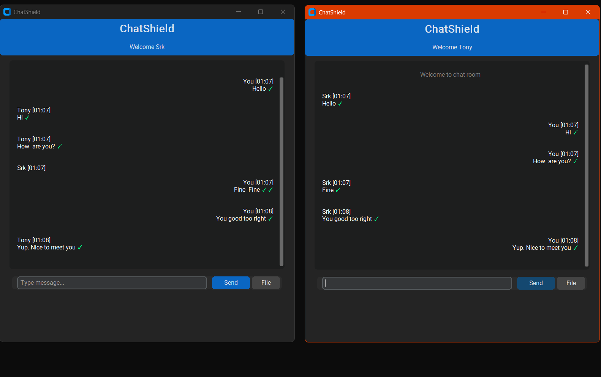
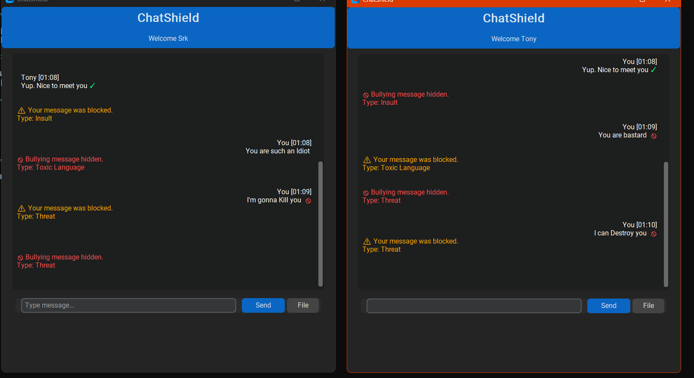

<div align="center">

# 🛡️ ChatShield

### Real-Time Cyberbullying Detection and Prevention System

<p align="center">
  <strong>Protecting Digital Conversations Through Intelligent Moderation</strong>
</p>

<p align="center">
  
  
  
  
  
</p>

</div>

---

# 📌 Overview

ChatShield is an advanced **real-time cyberbullying detection and prevention system** developed to improve the safety of digital communication platforms.
It monitors live chat messages, detects abusive/offensive content using **dataset-driven filtering**, blocks harmful messages before delivery, and instantly alerts users with **bullying type classification**.

Built to support **modern communication styles**, ChatShield can identify:

✔ Hinglish Bullying
✔ Abbreviations / Slang
✔ Masked Offensive Words
✔ Mixed-language Toxicity

---

# 🏗️ System Architecture

<p align="center">
  
</p>

---

# 🔄 Block Diagram

<p align="center">
  
</p>

---

# 🖥️ User Interface

## 📝 Register Screen

<p align="center">
  
</p>


## 🔐 Login Screen

<p align="center">
  
</p>

---

# 💬 Output Demonstration

## ✅ Safe Message Output

<p align="center">
  
</p>

## 🚫 Blocked Message Output

<p align="center">
  
</p>

---

# 📊 Performance Analysis

## 📈 Accuracy Comparison

<p align="center">
  
</p>

## ⚡ Model Performance

<p align="center">
  
</p>

---

# ✨ Key Features

<details>
<summary><strong>📌 Click to Expand Features</strong></summary>

### 🕒 Real-Time Monitoring

* Scans every message instantly before delivery

### 🚨 Cyberbullying Detection

* Detects abusive/offensive language in chats

### 🌐 Hinglish Support

* Detects Hindi-English mixed bullying messages

### 🔍 Slang Recognition

* Identifies masked/abbreviated offensive words

### 🧠 Bullying Classification

Classifies bullying into:

* Harassment
* Toxicity
* Insult
* Threat
* Hate Speech

### 🚫 Auto Blocking

* Blocks flagged messages automatically

### 🔔 Instant Alerts

* Warns sender and receiver immediately

### 🔐 Authentication

* Secure Login/Register System

### 🌍 Multi-User Support

* Client-server communication using sockets

</details>

---

# ⚙️ Workflow

```text id="mgsvrn"
User Message → Preprocessing → Hinglish/Slang Normalization 
→ Dataset Filtering → Classification → Block/Allow → Alert Generation
```

---

# 🛠️ Tech Stack

| Technology         | Usage            |
| ------------------ | ---------------- |
| Python             | Core Development |
| Tkinter            | GUI Framework    |
| Socket Programming | Networking       |
| Dataset Filtering  | Detection Logic  |
| Git/GitHub         | Version Control  |

---

# 🚀 Installation

### Clone Repository

```bash id="lbg8ux"
git clone https://github.com/sivaramakrishna2005/chatshield-cyberbullying-detection-system.git
```

### Run Server

```bash id="8lg8q5"
python server.py
```

### Run Client

```bash id="d6zjlwm"
python clientgui.py
```

---

# 🔮 Future Enhancements

* 🤖 Machine Learning Integration
* ☁ Cloud Deployment
* 📊 Admin Dashboard
* 🌎 Full Multilingual Detection
* 📱 Mobile Application

---

# 👨‍💻 Author

### **Siva Rama Krishna Naidu**

Computer Science Engineering Student

---

<div align="center">

### ⭐ If you like this project, give it a star on GitHub ⭐

</div>
