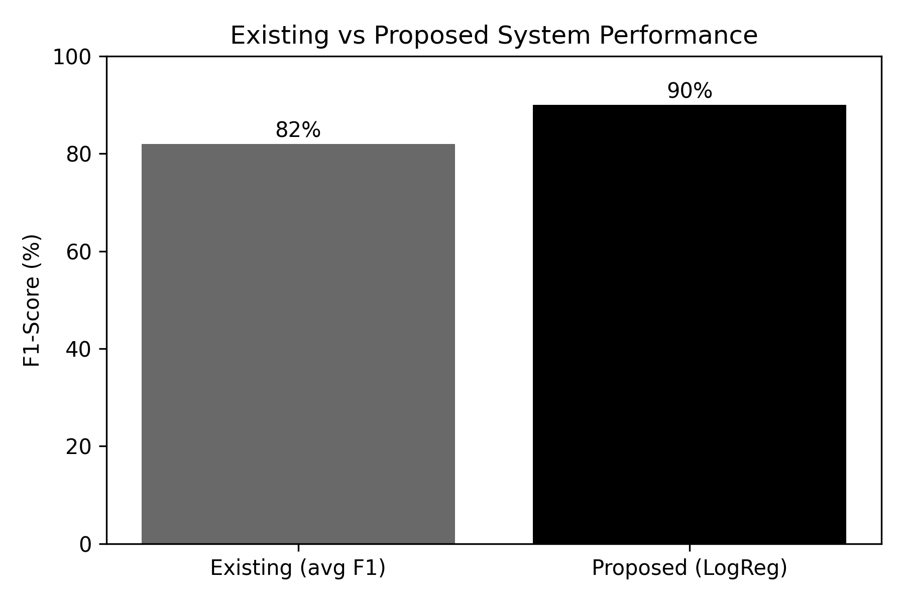
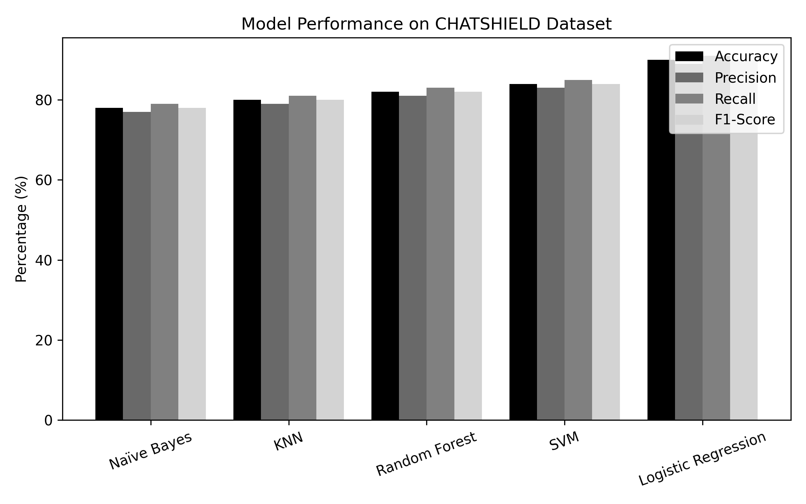

# ChatShield – Real-Time Cyberbullying Detection and Prevention System

## Protecting Digital Conversations Through Intelligent Moderation

ChatShield is an advanced real-time cyberbullying detection and prevention system developed to improve the safety of online communication platforms. The application monitors live chat messages, analyzes user input using dataset-driven text filtering and multilingual text normalization, blocks harmful or abusive messages before delivery, and provides instant alerts to both sender and receiver with bullying type categorization.

The system is designed to support modern communication patterns including Hinglish, multilingual slang, offensive abbreviations, and informal texting language, making it highly adaptable for real-world chat environments.

---

## Project Architecture

<p align="center">
  
</p>

---

## System Block Diagram

<p align="center">
  
</p>

---

## Graphical User Interface

### Registration Interface

<p align="center">
  
</p>

### Login Interface

<p align="center">
  
</p>


---

## Output Demonstration

### Safe Message Communication

<p align="center">
  
</p>

### Blocked Cyberbullying Detection Output

<p align="center">
  
</p>

---

## Model Evaluation Metrics

### Proposed Model Accuracy Graph

<p align="center">
  
</p>

### Performance Comparison Graph

<p align="center">
  
</p>

---

## Core Features

### Real-Time Message Monitoring

* Continuously monitors all incoming and outgoing chat messages before transmission.

### Cyberbullying Detection

* Detects harmful, abusive, offensive, and threatening text instantly.

### Hinglish Language Support

* Recognizes bullying messages written in mixed Hindi-English (Hinglish) format.
* Example: “Tu bahut useless hai”, “Pagal idiot”, etc.

### Slang & Abbreviation Recognition

* Detects offensive slang, short forms, and masked abusive words.
* Example: "idi0t", "stup!d", "f00l".

### Dataset-Driven Filtering

* Compares chat messages against a structured cyberbullying/offensive dataset.

### Bullying Type Classification

* Categorizes detected bullying into types such as:

  * Harassment
  * Toxicity
  * Insult
  * Threat
  * Hate Speech

### Message Blocking Mechanism

* Automatically blocks flagged messages before delivery.

### Instant Warning Alerts

* Sends warning notifications to both sender and receiver.

### User-Friendly GUI

* Interactive chat interface with modern design.

### Client-Server Communication

* Supports real-time multi-user communication through socket programming.

### Authentication Module

* Login/Register system for secure user access.

---

## Workflow

1. User enters message in chat interface
2. System preprocesses text input
3. Hinglish/slang normalization applied
4. Message checked against bullying dataset
5. Classification logic determines bullying type
6. If harmful:

   * Message blocked
   * Alert displayed
   * Type identified
7. Else:

   * Message delivered successfully

---

## Technology Stack

| Technology         | Purpose                     |
| ------------------ | --------------------------- |
| Python             | Core Programming Language   |
| Tkinter            | GUI Development             |
| Socket Programming | Client-Server Communication |
| Dataset Filtering  | Text Analysis               |
| Git/GitHub         | Version Control             |
| VS Code            | Development Environment     |

---

## Installation & Setup

### Clone Repository

```bash
git clone https://github.com/your-username/chatshield-cyberbullying-detection-system.git
```

### Navigate to Project Folder

```bash
cd chatshield-cyberbullying-detection-system
```

### Run Server

```bash
python server.py
```

### Run Client

```bash
python clientgui.py
```

---

## Future Enhancements

* Machine Learning Based Detection
* NLP Sentiment Analysis
* Voice Chat Moderation
* Cloud Deployment
* Admin Monitoring Dashboard
* Database Integration
* Mobile Application Support

---

## Author

**Siva Rama Krishna Naidu**
Computer Science Engineering Student

---

## License

This project is developed for academic, educational, and research purposes.
